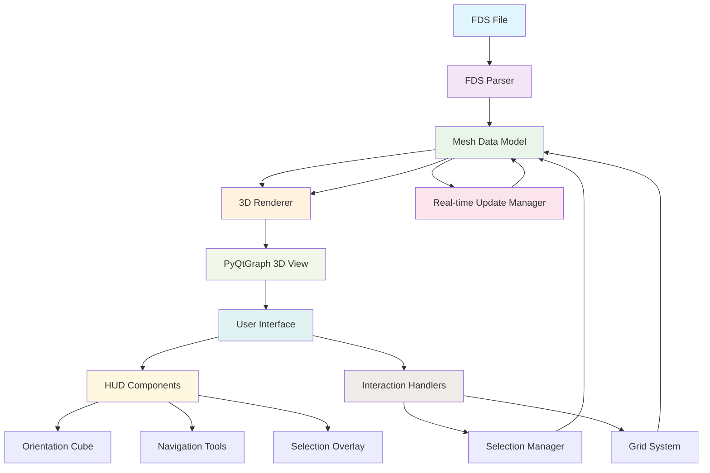
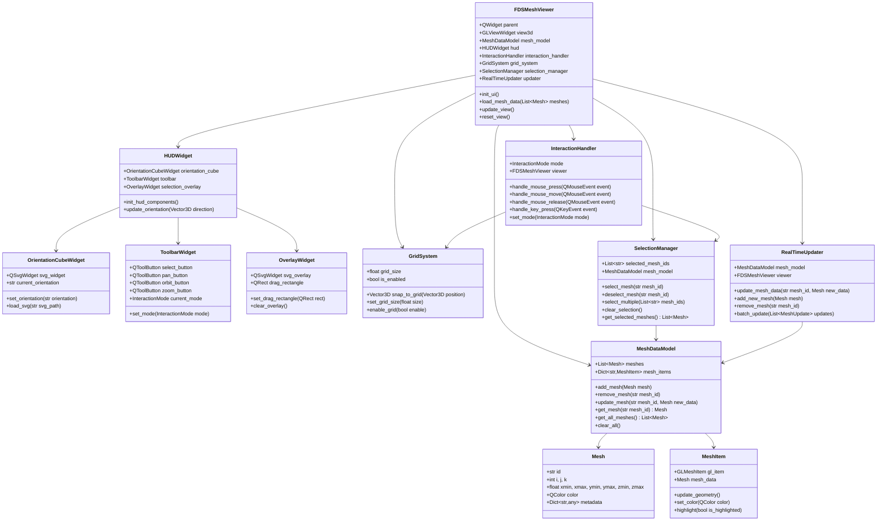

# 3D Visualization Architecture for FDS MESH Entities

## 1. Overall Architecture Diagram

## 2. Class Structure for 3D Visualization Component

## 3. MESH Data to 3D Representation Conversion

The conversion from FDS MESH data to 3D representations follows this process:

1. **Data Extraction**: Parse FDS file to extract MESH entities with parameters:
   - I, J, K (cell counts)
   - Xmin, Xmax, Ymin, Ymax, Zmin, Zmax (spatial boundaries)

2. **3D Box Creation**: For each MESH entity:
   - Create a 3D box using the spatial boundaries
   - Calculate vertices from min/max coordinates
   - Generate faces for the box (6 faces total)

3. **Visual Properties**:
   - Assign distinct colors to different MESH entities
   - Set transparency for better visualization of overlapping meshes
   - Add wireframe representation for clear boundaries

4. **PyQtGraph Integration**:
   - Convert box geometry to GLMeshItem format
   - Add to 3D view with appropriate transformations
   - Maintain mapping between FDS mesh ID and 3D item

## 4. Data Flow from FDS Parsing to 3D Rendering

```mermaid
flowchart LR
    A[FDS File] --> B[Parsing Module]
    B --> C[Mesh Data Extraction]
    C --> D[Data Validation]
    D --> E[Mesh Data Model]
    E --> F[3D Geometry Generation]
    F --> G[PyQtGraph GLMeshItem Creation]
    G --> H[3D View Integration]
    H --> I[Rendering]
    
    style A fill:#e1f5fe
    style B fill:#f3e5f5
    style C fill:#e8f5e8
    style D fill:#fff3e0
    style E fill:#fce4ec
    style F fill:#f1f8e9
    style G fill:#e0f2f1
    style H fill:#fff8e1
    style I fill:#efebe9
```

## 5. Real-time Update Mechanism

The real-time update mechanism ensures that changes to mesh data are immediately reflected in the 3D visualization:

1. **Update Triggers**:
   - Manual mesh modifications (refinement, partitioning)
   - File reload operations
   - External data changes

2. **Update Process**:
   - Detect changes in mesh data
   - Calculate differences (added, removed, modified meshes)
   - Apply changes to 3D representation
   - Update visual properties as needed

3. **Performance Considerations**:
   - Batch updates for multiple changes
   - Only update changed elements
   - Use efficient data structures for change tracking

## 6. Selection and Interaction Handling

The selection and interaction system provides intuitive control over the 3D visualization:

1. **Selection Modes**:
   - Single mesh selection
   - Multiple mesh selection (Ctrl+Click)
   - Rectangle selection (Drag)
   - Deselection (Click empty space or Esc)

2. **Interaction Modes**:
   - **Select Mode**: For selecting meshes
   - **Pan Mode**: For translating the view
   - **Orbit Mode**: For rotating the view
   - **Zoom Mode**: For scaling the view

3. **Visual Feedback**:
   - Highlight selected meshes
   - Show selection rectangle during drag
   - Update orientation cube based on view direction

## 7. Grid System Implementation

The grid system assists with precise positioning and alignment:

1. **Grid Representation**:
   - Visual grid lines in 3D space
   - Configurable grid spacing
   - Toggle visibility on/off

2. **Snap-to-Grid**:
   - Align mesh positions to grid points
   - Visual feedback during movement
   - Configurable grid size

3. **Integration**:
   - Works with selection and movement operations
   - Respects current view orientation
   - Updates dynamically with view changes

## 8. HUD Interface Design with SVG Icons

The HUD (Heads-Up Display) provides essential controls and information:

1. **Orientation Cube**:
   - Shows current view direction
   - Uses `orientation_cube.svg` for base representation
   - Highlights current face based on view angle

2. **Navigation Toolbar**:
   - Select tool using `select_icon.svg`
   - Pan tool using `pan_icon.svg`
   - Orbit tool using `orbit_icon.svg`
   - Zoom tool using `zoom_icon.svg`

3. **Selection Overlay**:
   - Uses `selection_overlay.svg` for rectangle selection
   - Semi-transparent design for clear visibility
   - Dynamically sized based on selection area

## 9. Performance Optimization Strategies

To ensure smooth performance with large mesh datasets:

1. **Level of Detail (LOD)**:
   - Simplified representations for distant meshes
   - Dynamic switching based on view distance

2. **Culling**:
   - Frustum culling to hide off-screen meshes
   - Occlusion culling for hidden meshes

3. **Efficient Data Structures**:
   - Spatial partitioning for faster lookups
   - Batched rendering for multiple meshes

4. **Memory Management**:
   - Reuse 3D objects when possible
   - Clean up unused resources

## 10. Implementation Specifications

### Core Components

1. **FDSMeshViewer** (Main 3D visualization widget):
   - Inherits from QWidget
   - Integrates PyQtGraph's GLViewWidget
   - Manages all 3D visualization components

2. **MeshDataModel** (Data management):
   - Stores all mesh data and 3D representations
   - Provides CRUD operations for meshes
   - Maintains synchronization between data and view

3. **HUD Components** (User interface elements):
   - Orientation cube for view direction
   - Toolbar for interaction modes
   - Overlay for selection feedback

### Integration Points

1. **With Existing FDS Tools**:
   - Connect to file selection widget
   - Receive mesh data from parsing functions
   - Update when file operations occur

2. **PyQtGraph Integration**:
   - Use GLViewWidget as 3D container
   - Create GLMeshItem for each mesh
   - Handle view transformations and interactions

3. **Event Handling**:
   - Mouse interactions for navigation and selection
   - Keyboard shortcuts for common operations
   - Real-time updates from data changes

### Technical Requirements

1. **Dependencies**:
   - PyQt6 for UI components
   - PyQtGraph for 3D rendering
   - NumPy for mathematical operations

2. **Performance Targets**:
   - Smooth interaction with up to 1000 meshes
   - Real-time updates with minimal lag
   - Responsive UI during rendering

3. **Compatibility**:
   - Cross-platform support (Windows, macOS, Linux)
   - Integration with existing FDS Mesh Tools application
   - Support for various FDS file versions